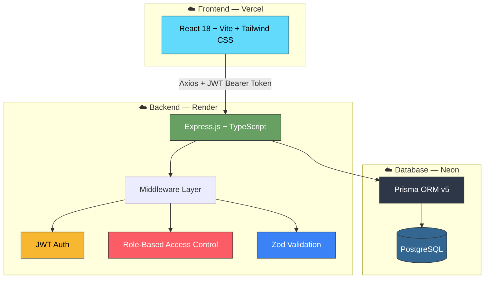
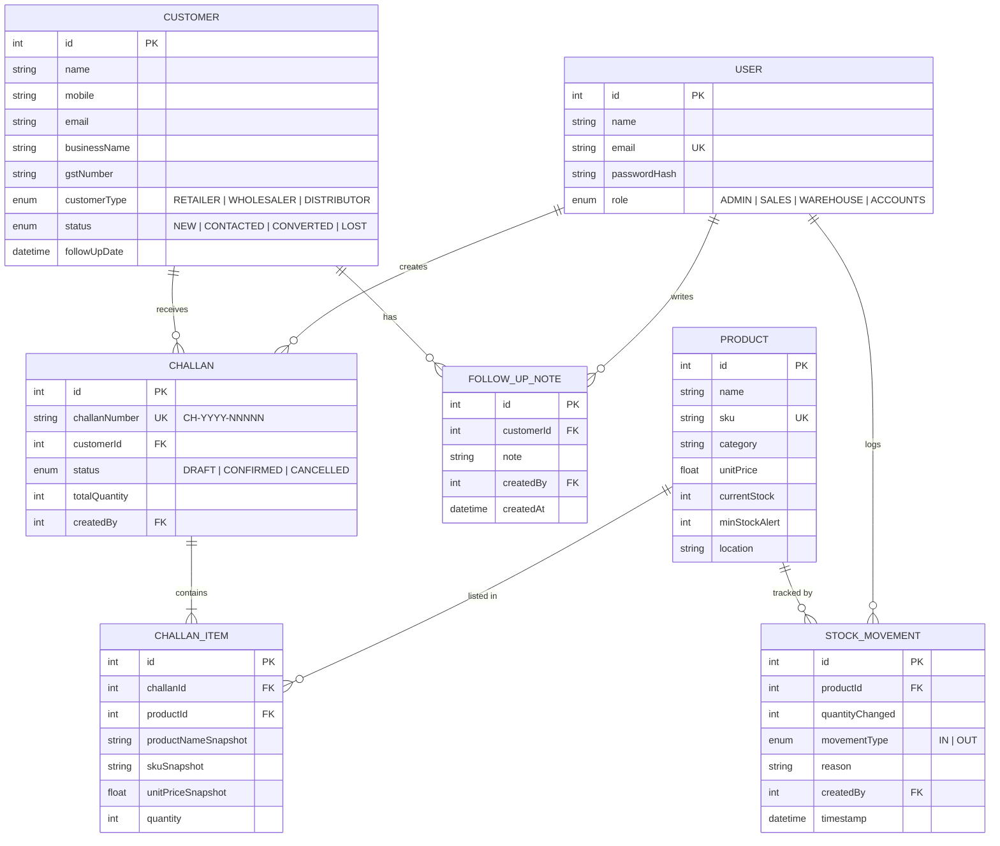
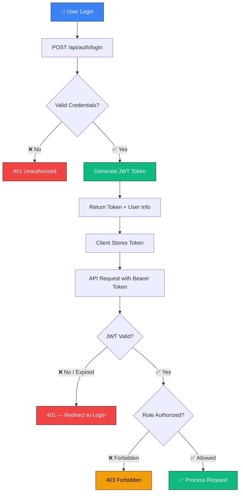
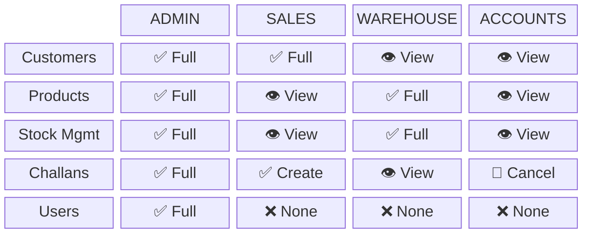
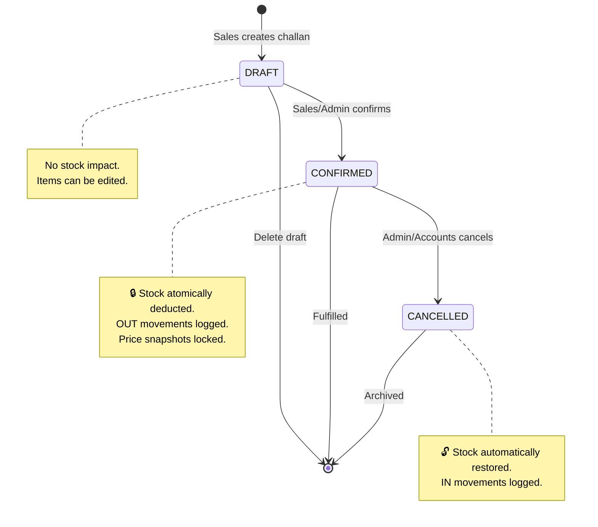
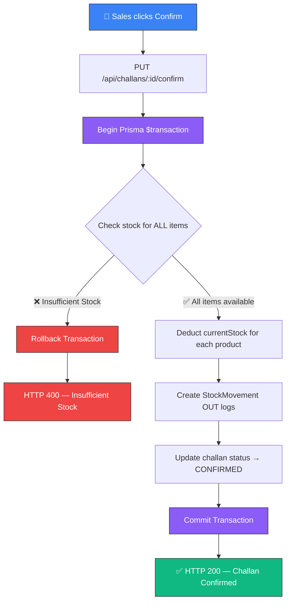
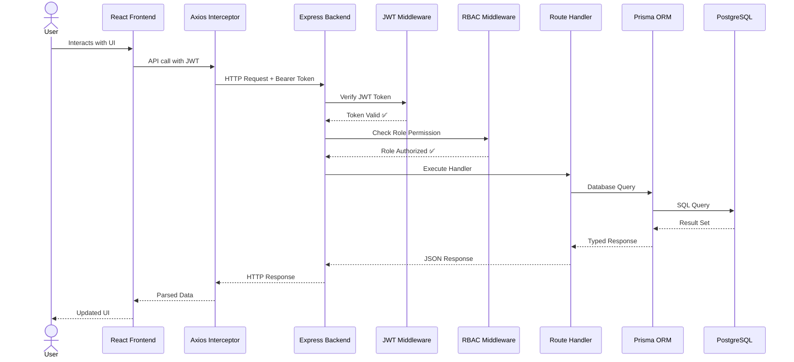

# 🚀 Fundsroom — Mini ERP + CRM Operations Portal

A production-ready, full-stack **Wholesale & Distribution ERP / CRM System** built with **Node.js, Express, TypeScript, Prisma ORM, PostgreSQL**, and **React (Vite + Tailwind CSS)**.

---

## 🌐 Live Deployment Links

| Service | URL |
| :--- | :--- |
| **Live Frontend** | https://fundsroom-liart.vercel.app/ |
| **Live Backend API** | https://fundsroom-20u1.onrender.com/api |

| **PostgreSQL Database** | Neon PostgreSQL — AWS ap-southeast-1 |

---

## 🔑 Test Login Credentials

All demo accounts share the same password: **`Password123`**

| Role | Email | Access Level |
| :--- | :--- | :--- |
| **Admin** | `admin@fundsroom.com` | Full system access — manage users, customers, products, challans |
| **Sales** | `sales@fundsroom.com` | Customer CRM, add/edit leads, create & confirm sales challans |
| **Warehouse** | `warehouse@fundsroom.com` | Catalog management, manual stock intake & adjustment logs |
| **Accounts** | `accounts@fundsroom.com` | View ledger, cancel challan/invoice (restores stock locks) |

---

## 🏗️ Architecture Overview

This is a **monorepo** project containing two independent services:



### Project Structure

```
fundsroom/
├── backend/                    # Node.js + Express + TypeScript + Prisma API server
│   ├── prisma/
│   │   ├── schema.prisma       # PostgreSQL database schema & relational models
│   │   └── seed.ts             # Database seeding script (users, products, challans)
│   ├── src/
│   │   ├── config/             # Environment configuration with Zod validation
│   │   ├── middleware/         # JWT verification & Role-Based Access Control (RBAC)
│   │   ├── routes/             # Auth, Customers, Products, Challans route handlers
│   │   ├── prisma.ts           # Prisma client singleton
│   │   └── app.ts              # Express app setup (CORS, Helmet, routes)
│   └── Dockerfile              # Production multi-stage Docker build
├── frontend/                   # React 18 + Vite + TypeScript + Tailwind CSS admin app
│   ├── src/
│   │   ├── api.ts              # Axios instance with JWT interceptor & 401 redirects
│   │   ├── components/         # Dashboard, Customers, Products, Challans, Navbar, Auth
│   │   └── types.ts            # Shared TypeScript interfaces
│   ├── vercel.json             # Vercel SPA routing config
│   ├── nginx.conf              # Production Nginx proxy config
│   └── Dockerfile              # Production multi-stage Nginx container build
├── docker-compose.yml          # Container orchestrator (local dev)
├── postman_collection.json     # Exportable Postman API collection
└── README.md                   # Full project documentation
```

### Tech Stack

| Layer | Technology |
| :--- | :--- |
| **Backend Runtime** | Node.js 20 + TypeScript |
| **Backend Framework** | Express.js |
| **Database** | PostgreSQL (Neon serverless) |
| **ORM** | Prisma v5 |
| **Authentication** | JWT (jsonwebtoken + bcryptjs) |
| **Validation** | Zod |
| **Frontend Framework** | React 18 + TypeScript |
| **Build Tool** | Vite |
| **Styling** | Tailwind CSS |
| **HTTP Client** | Axios |
| **Containerization** | Docker + Docker Compose |
| **Frontend Hosting** | Vercel |
| **Backend Hosting** | Render |
| **Database Hosting** | Neon PostgreSQL |

---

## 📊 Database Schema

### Entity Relationship Diagram



### Models Summary

| Model | Key Fields |
| :--- | :--- |
| **User** | id, name, email, passwordHash (bcrypt), role (ADMIN/SALES/WAREHOUSE/ACCOUNTS) |
| **Customer** | id, name, mobile, email, businessName, gstNumber?, customerType, address, status, followUpDate, notes |
| **FollowUpNote** | id, customerId, note, createdBy, createdAt |
| **Product** | id, name, sku (unique), category, unitPrice, currentStock, minStockAlert, location |
| **StockMovement** | id, productId, quantityChanged, movementType (IN/OUT), reason, createdBy, timestamp |
| **Challan** | id, challanNumber (auto CH-YYYY-NNNNN), customerId, status (DRAFT/CONFIRMED/CANCELLED), totalQuantity, createdBy |
| **ChallanItem** | id, challanId, productId, productNameSnapshot, skuSnapshot, unitPriceSnapshot, quantity |

### Critical Business Logic
- **Atomic Stock Deduction**: Confirming a challan runs stock deduction and OUT movement logging inside a Prisma `$transaction`. If any product has insufficient stock, the entire transaction rolls back with HTTP 400.
- **Negative Stock Guard**: Manual stock adjustments prevent inventory from dropping below zero.
- **Snapshot Integrity**: Prices and product names are snapshotted into ChallanItem rows so historical totals remain accurate even if catalog prices change later.
- **Stock Restoration on Cancel**: Cancelling a confirmed challan automatically restores inventory via an IN movement log.

---

## 🚀 Quick Start — Local Setup

### Prerequisites
- Node.js v20+
- npm v9+
- A PostgreSQL database (local or cloud — Neon is free)

### 1. Clone the Repository
```bash
git clone https://github.com/NULLPOINTERCODER/fundsroom.git
cd fundsroom
```

### 2. Backend Setup

```bash
cd backend
npm install
cp .env.example .env
```

Edit `backend/.env`:
```env
PORT=5000
DATABASE_URL="postgresql://<user>:<password>@<host>/<database>?sslmode=require"
JWT_SECRET="your-secure-secret-key"
NODE_ENV="development"
```

Run migrations and seed:
```bash
npx prisma generate
npx prisma db push
npx ts-node prisma/seed.ts
npm run dev
```

Backend runs at: `http://localhost:5000`

### 3. Frontend Setup

```bash
cd frontend
npm install
npm run dev
```

Frontend runs at: `http://localhost:5173`

---

## ⚙️ How Environment Variables Are Managed

Variables are stored in `backend/.env` which is excluded from version control via `.gitignore`. A `backend/.env.example` template is committed for developer reference. In production, variables are set directly in the **Render dashboard** — never hardcoded. The backend uses **Zod** to validate all required env vars on startup.

---

## 🐳 Docker Setup

```bash
docker-compose up --build
```

| Service | URL |
| :--- | :--- |
| **Frontend** | http://localhost:8080 |
| **Backend API** | http://localhost:5000/api |

---

## ☁️ Deployment Guide

### Backend — Render

1. Go to [Render](https://render.com) → New Web Service → Connect `NULLPOINTERCODER/fundsroom`
2. Settings:
   - **Root Directory**: `backend`
   - **Build Command**: `npm install --production=false && npx prisma generate && npm run build`
   - **Start Command**: `node dist/index.js`
3. Add Environment Variables: `PORT`, `DATABASE_URL`, `JWT_SECRET`, `NODE_ENV=production`
4. Deploy

> **Note:** `--production=false` ensures TypeScript `@types/*` packages install during build for `tsc` compilation.

### Frontend — Vercel

1. Go to [Vercel](https://vercel.com) → Add New Project → Import `NULLPOINTERCODER/fundsroom`
2. Set **Root Directory** to `frontend`, Framework Preset to **Vite**
3. Deploy

### Database — Neon

1. Sign up at [Neon](https://neon.tech), create a project, copy the connection string
2. Use as `DATABASE_URL` in both local `.env` and Render dashboard

---

## 🔐 Authentication & RBAC Flow



### Role Permissions Matrix



---

## 📦 Challan Lifecycle Flow



### Challan Confirmation — Transaction Flow



---

## 🔄 API Request Lifecycle



---

## 📑 Postman Collection & API Reference

Import `postman_collection.json` from the repo root into Postman.

Set collection variable `baseUrl` to:
- Local: `http://localhost:5000/api`
- Live: `https://fundsroom-20u1.onrender.com/api`

### API Endpoints

| Method | Endpoint | Description | Roles |
| :--- | :--- | :--- | :--- |
| POST | `/api/auth/login` | Login, returns JWT token | Public |
| GET | `/api/auth/me` | Get current user profile | Any |
| GET | `/api/customers` | List customers (search, filter, paginate) | Any |
| POST | `/api/customers` | Create new customer | ADMIN, SALES |
| PUT | `/api/customers/:id` | Update customer | ADMIN, SALES |
| GET | `/api/customers/:id` | Customer detail + follow-up notes | Any |
| POST | `/api/customers/:id/notes` | Add follow-up note | ADMIN, SALES |
| GET | `/api/products` | List products (search, filter, paginate) | Any |
| POST | `/api/products` | Create new product | ADMIN, WAREHOUSE |
| PUT | `/api/products/:id` | Update product | ADMIN, WAREHOUSE |
| GET | `/api/products/:id/stock-movements` | Stock movement history | Any |
| POST | `/api/products/:id/stock-movements` | Add manual stock movement | ADMIN, WAREHOUSE |
| GET | `/api/challans` | List challans (filter, paginate) | Any |
| POST | `/api/challans` | Create draft challan | ADMIN, SALES |
| GET | `/api/challans/:id` | Challan detail with line items | Any |
| PUT | `/api/challans/:id/confirm` | Confirm challan (atomically deducts stock) | ADMIN, SALES |
| PUT | `/api/challans/:id/cancel` | Cancel challan (restores stock) | ADMIN, ACCOUNTS |

---

## 🎁 Bonus Features

| Feature | Status | Notes |
| :--- | :---: | :--- |
| Docker Setup | ✅ Done | `docker-compose.yml` + `Dockerfile` in both services |
| Export Invoice as PDF | ✅ Done | Print-to-PDF browser modal via `InvoicePrintModal.tsx` |
| GitHub Actions CI/CD | ❌ Optional | Manual deployment used — CI/CD is a bonus feature per PDF |
| Product Image Upload (AWS S3) | ❌ Optional | Not implemented — listed as optional bonus in PDF |

---

## ⚠️ Known Limitations

| Area | Notes |
| :--- | :--- |
| Product Image Upload | No image upload — listed as optional bonus only |
| GitHub Actions CI/CD | Manual deployment used — bonus feature per PDF |
| AWS Hosting | Vercel + Render used — PDF explicitly allows this as an alternative |
| Render Cold Start | Free tier spins down after inactivity; first API call may take 30–60 seconds |
| Role Management UI | Roles are assigned via seed data only, no in-app admin UI |
| GST Tax Breakdown | Invoices show totals but no GST breakdown calculation |

---

## 📋 Assumptions Made

1. Simple JWT auth (no refresh tokens) as specified in the PDF.
2. Roles are assigned at seed time — no in-app UI for role changes.
3. Only `CONFIRMED` challans can be cancelled; `DRAFT` challans can be deleted.
4. Cancelling a `CONFIRMED` challan restores all stock via `IN` movement logs.
5. Database hosted on Neon free tier in `AWS ap-southeast-1`.
6. Invoice grand totals are computed from `unitPriceSnapshot * quantity` on the frontend.
